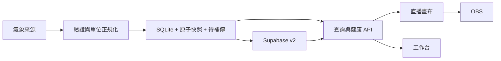

# Weather Tower 2.1 — 直播氣象資訊

固定 OBS 畫布、獨立工作台、可驗證時間與來源的觀測、本機交易保存與雲端待補傳。繁體中文介面，圖表、字型與圖示由本機提供。

## 安裝與啟動

使用 `.node-version` 指定的 **Node.js 24.13.1**，目前支援 24.x。該版本的內建 node:sqlite 仍會顯示 ExperimentalWarning；升級 Node 前須重跑測試及備份／復原驗證。

```powershell
cd D:\weathertower
npm ci
npm start
```

第一次使用才將 `.env.example` 複製為 `.env`；已有設定請保留並補入欄位。安裝自動產生 public/vendor 的固定版本 Chart.js、中文字型及授權文件，可用 `npm run build` 重建。安裝需要網路，播出頁不依賴 CDN。

工作台：<http://127.0.0.1:3005/control>。設定儲存在瀏覽器與網址，不更動伺服器；分享播出網址可重現模板。

## 資料模式

| APP_MODE | 氣象 API | 雲端 | 本機 |
| --- | --- | --- | --- |
| live | 定時擷取真實觀測 | 讀歷史、補傳 | 保存與待補傳 |
| playback | 不呼叫 | 唯讀 | 可保存已驗證最新觀測，不上傳 |
| offline | 不呼叫 | 不連線 | 播放有效紀錄 |

預設 playback；沒有 APP_MODE 且 NODE_ENV=production 時為 live。正式採集設定 `APP_MODE=live` 與 HTTPS WEATHER_API_URL。`npm run start:offline` 明確離線預覽。demo=true 是獨立可重現的示範，永久顯示「非實測」、不保存、不上傳；正式缺資料不會自動啟用。DEMO_ENABLED=false 可禁止示範 API。

## OBS 設定

在工作台選版型、測站、深色／透明、風速單位、圖表、時間範圍及輪播，複製播出網址至 OBS 瀏覽器來源。擷取 `/overlay`。

| 版型 | 寬×高 | 內容 |
| --- | --- | --- |
| wall | 600×640 | 攝影機牆面用兩欄大數值與大刻度趨勢圖；預設最近6小時 |
| full | 1920×1080 或 1280×720 | 六項觀測、單張趨勢、來源與狀態；等比縮放 |
| sidebar | 480×1080 | 六項觀測直式排列 |
| ticker | 1920×180 | 測站、狀態與六項觀測 |

```text
http://127.0.0.1:3005/overlay?layout=full&theme=dark&chart=temp&hours=12&windUnit=ms
http://127.0.0.1:3005/overlay?layout=sidebar&theme=transparent&windUnit=kmh
http://127.0.0.1:3005/overlay?layout=ticker&demo=true
http://127.0.0.1:3005/overlay?layout=wall&theme=dark&chart=cycle&hours=6&cycle=7.5&windUnit=ms
```

牆面版在 OBS 直接設定瀏覽器來源 600×640、縮放100%。1920×1080 攝影機場景的起始位置為 X=16、Y=420，可依屋簷微調；720p 場景縮至400×427、位置約11、280。此版使用接近實底的深色資訊板，保留天空、街道與右下品牌。選擇牆面版會套用6小時與7.5秒輪播，可再自行調整圖表。

chart 支援 temp/humidity/wind/direction/pressure/rain/cycle，cycle 為 7.5/15/20/30 秒（預設7.5秒）；hours 為 6/12/24。date=YYYY-MM-DD 為臺北日期回放並永久標示日期；station 可指定站號。原 `/?obs=true` 轉至透明播出頁。

OBS 初始可用 30 FPS，先關閉「不可見時卸載」及「場景啟用時重新整理」，再依現場效能調整。透明模式保留資訊底板，需在亮天空、夜景與複雜影像上驗收。[OBS 官方說明](https://obsproject.com/kb/browser-source)

## 資料與架構

- 保存來源 observed_at 及另行 fetched_at；新鮮度依觀測時間，固定臺北時區。
- 風速統一 m/s，metric 的 km/h 僅換算一次；雨量區分日累積 mm、十分鐘 mm、雨強 mm/h；海平面氣壓 hPa。
- 缺測為 null／—，不轉零。移除無來源的日照數字。異常範圍、露點或陣風隔離並標示 suspect；unchecked 表示未取得來源 QC 通過的確認。
- 延遲門檻 max(180 秒, 2.5×觀測間隔)，過期門檻 max(600 秒, 6×間隔)。斷線保留有效值及原時間。
- 趨勢用真實時間、直線與缺口；最高／最低／樣本平均由有效原始樣本計算。風向散點與圓形平均；低於 0.3 m/s 不列入主向。
- 十分鐘雨量需完整覆蓋；缺測、午夜、重置、負差、不完整區間留空。跨日圖表的「當日累積」取最後觀測所在日期，不是整段總量。
- 舊 JSON 僅匯入具有可驗證 raw_data 與觀測時間的紀錄，原檔不修改。既有 576 筆缺少必要欄位，未冒充實測。



src/config.js 管設定，network.js 處理完整回應逾時與有限重試，repository.js 管本機交易，cloud.js 管遠端，weather-service.js 管不重疊採集與快取，app.js 管路由。public/js/model.js 為前後端共用規則。

| GET API v2 | 回傳 |
| --- | --- |
| /api/weather/latest | version、可為 null 的 observation、status、站名、輪詢間隔 |
| /api/weather/history?hours=12 | observations、真實時間 range、來源、degraded、間隔 |
| /api/weather/history?date=2026-09-30 | 臺北該日半開區間 [00:00, 次日00:00) |
| /api/status | 採集、雲端、儲存、待補傳、記憶體；無密鑰與原始回應 |
| /api/health | 服務存活；不代表觀測新鮮或雲端正常 |

v2 不相容舊 raw_data 直出。所有 GET 不新增模擬紀錄或雲端寫入。背景服務採集；歷史合併本機、新表及格式可驗證舊表，依站號／時間短期快取。

## Supabase 升級

1. SQL Editor 執行 `migrations/001_weather_observations_v2.sql`：新增 v2 表、去重鍵、欄位約束、索引、RLS，保留舊表。
2. 後端設定 SUPABASE_URL 與 SUPABASE_SERVICE_ROLE_KEY，僅放私密環境變數。
3. 工作台確認 cloud=ready、migration_required=false，待補傳下降；同筆觀測 upsert 不重複新增。
4. 舊前端切換完成後，執行 `002_restrict_legacy_access.sql` 移除舊表匿名存取，不刪紀錄。

缺 v2 時提示升級，嘗試唯讀舊表，新資料留在本機排隊。現有 service-role REST 憑證不能執行 SQL DDL，遷移檔準備完成不代表遠端已執行。schema.sql 對應第一份遷移。

## 長時間運作與備份

```powershell
npm run start:supervised
npm run backup
npm run soak -- --hours 8
```

supervisor 在異常退出後退避重啟，Ctrl+C 停父子程序；不替代開機服務。backup 產生 DATA_DIR/backups 下的 SQLite 線上備份。soak 記錄服務狀態至 review，**不等同 OBS 錄製驗收**。

預設 data/ 不進版控。SQLite WAL＋FULL 同步；latest.json 經暫存、同步、原子替換，保留有效 previous。損壞資料庫保留原檔，使用 recovery 資料庫從快照復原最新值，active-database.json 保持重啟指向；歷史需完整資料庫備份，不能靠最新快照完整恢復。

另將備份複製至不同磁碟。還原先停服務、備份整個 DATA_DIR，將選定備份放在新的 DATA_DIR 再修改設定啟動；不要在線替換主資料庫，也不要遺漏 -wal/-shm 與復原指標。已上傳歷史按 RETENTION_DAYS 清理，但保留每站最後有效值及全部待補傳；長期雲端故障應監看磁碟。

## 部署、安全與驗證

本機預設 127.0.0.1；公開部署用 HTTPS 反向代理與 HOST=0.0.0.0。工作台無可更動服務的管理 API；若需限制健康資訊，另在代理保護入口。API 每來源 IP 每分鐘 180 次；代理後另設邊緣限流，不盲目信任 X-Forwarded-For。

render.yaml 提供付費服務及持久磁碟範本，尚未建立資源。先檢查費用、容量、私密設定；沒有持久磁碟不能承諾重新部署後保留備援。[Render 磁碟說明](https://render.com/docs/disks)

.env.example 已清空密鑰；既有 Git 歷史曾包含氣象 API key，仍需在提供者端更換並更新部署設定。不要將 .env、data、備份或金鑰發布。

```powershell
npm test
npm run format:check
npm audit --omit=dev
```

CI 已提供資產建置、格式、測試及套件稽核設定，尚未推送觸發。依 [checkout](https://github.com/actions/checkout) 與 [setup-node](https://github.com/actions/setup-node) 官方設定使用唯讀權限。

本次結果見 `review/實作完成與驗證_20260930.md`。正式播出仍需 OBS 8 小時、場景切換、斷線復原、壓縮可讀性與現場資料驗收。
